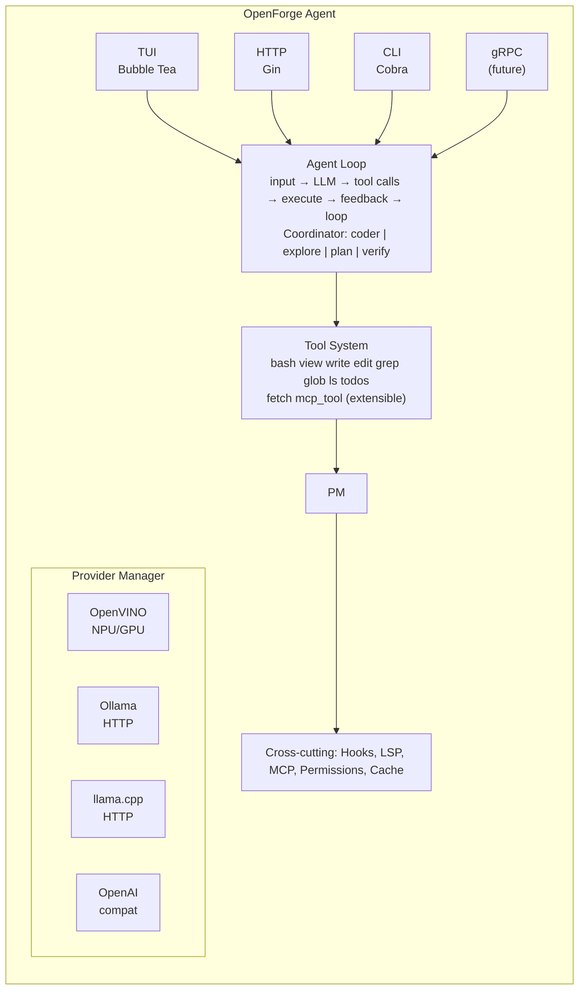

# OpenForge

**AI Coding Agent** — 100% local. NPU, GPU, CPU. Zero cloud.

```bash
openforge                              # TUI interativo — agente de código
openforge serve                        # HTTP server (OpenAI-compatible API)
openforge provider list                # Lista runtimes de inferência detectados
openforge provider install ollama      # Instala um runtime local
```

## O que é

OpenForge é um **agente de código AI** que roda 100% localmente. Ele lê, escreve, edita e executa código usando ferramentas controladas pelo LLM, com suporte a múltiplos runtimes de inferência (OpenVINO, Ollama, llama.cpp, vLLM, LM Studio).

Diferente de IDEs ou agentes cloud, o OpenForge:
- **Não depende de rede** — tudo roda local
- **Usa hardware real** — NPU Intel, GPU, CPU
- **É provider-agnóstico** — troque de runtime sem mudar nada
- **Tem ferramentas reais** — bash, grep, edit, write, glob, LSP, hooks
- **Segue o padrão Agent Skills** — compatível com SKILL.md

## Features

### Agente de Código
- **Agent loop com function calling** — o LLM decide quais ferramentas usar
- **Tools built-in**: bash, view, write, edit, grep, glob, ls, todos, fetch
- **Sub-agents**: coder, explore, plan, verify — cada um com system prompt especializado
- **Hooks**: PreToolUse/PostToolUse — bloqueie comandos perigosos, injete contexto
- **LSP Manager**: auto-detect gopls, typescript-language-server, rust-analyzer, pyright
- **MCP**: Model Context Protocol — conecte servidores externos de ferramentas

### Inferência Local
- **Provider agnóstico**: OpenVINO (NPU/GPU/CPU), Ollama, llama.cpp, vLLM, LM Studio
- **OpenAI-compatible API**: `/v1/chat/completions`, `/v1/embeddings`, `/v1/models`
- **Smart device selection**: NPU > GPU > CPU, fallback automático por workload
- **Auto-discovery**: detecta runtimes instalados, port scan, health check
- **Stub mode**: compila sem OpenVINO para desenvolvimento
- **Multi-plataforma**: Windows, Linux, macOS, WSL

### TUI Interativo
- **Streaming token a token** com markdown rendering
- **Autocomplete** de comandos, modelos e dispositivos
- **Status bar** com modelo ativo, dispositivo e tok/s
- **Tool feedback** visual quando o agente usa ferramentas

## Quickstart

```bash
# 1. Instalar um runtime local (recomendado: Ollama)
openforge provider install ollama
ollama pull llama3.2:3b
ollama serve

# 2. Rodar o agente
openforge

# 3. Ou iniciar o servidor HTTP
openforge serve

# 4. Chat via API OpenAI-compatível
curl -X POST http://localhost:9090/v1/chat/completions \
  -H "Content-Type: application/json" \
  -d '{"model":"llama3.2:3b","messages":[{"role":"user","content":"Explique RC quântica"}]}'
```

## CLI

| Command | Description |
|---------|-------------|
| `openforge` | Agente interativo (TUI) |
| `openforge serve` | Servidor HTTP API |
| `openforge provider list` | Lista runtimes detectados |
| `openforge provider install <name>` | Instala um runtime |
| `openforge provider detect` | Scan completo de hardware + runtimes |
| `openforge provider guide` | Guia de instalação por plataforma |
| `openforge config init` | Gera config.yaml otimizada |
| `openforge model list` | Lista modelos disponíveis |
| `openforge devices` | Lista dispositivos de hardware |
| `openforge benchmark` | Benchmark de performance |
| `openforge version` | Versão |

## Arquitetura



## Providers

| Provider | Hardware | Modelos | Interface | Instalação |
|----------|----------|---------|-----------|------------|
| **OpenVINO** | CPU, GPU Intel, NPU Intel | IR (.xml+.bin) | CGO nativo | `pip install openvino` |
| **Ollama** | CPU, GPU (CUDA/Vulkan) | GGUF | HTTP REST | `winget install Ollama` |
| **llama.cpp** | CPU, GPU (CUDA/Metal) | GGUF | HTTP REST | `brew install llama.cpp` |
| **vLLM** | GPU (CUDA) | HF, safetensors | OpenAI-compat | `pip install vllm` |
| **LM Studio** | CPU, GPU | GGUF | OpenAI-compat | `winget install LMStudio` |

## Tools

| Tool | Descrição |
|------|-----------|
| `bash` | Executa comandos shell com proteção contra padrões perigosos |
| `view` | Lê arquivo com offset/limit e numeração de linhas |
| `write` | Cria/sobrescreve arquivo |
| `edit` | Find-and-replace exato em arquivo |
| `grep` | Busca conteúdo em arquivos (regex ou literal) |
| `glob` | Encontra arquivos por padrão glob |
| `ls` | Lista diretório como árvore |
| `todos` | Gerencia lista de tarefas (pending/in_progress/completed) |
| `fetch` | Busca conteúdo de URL (opcional, requer rede) |

## Configuração

```yaml
# openforge.yaml
providers:
  chain: [openvino, ollama, llamacpp, vllm, lmstudio]

  workloads:
    chat: auto
    embed: auto
    code: auto

  openvino:
    enabled: true
    model_path: ./models
    device: auto

  ollama:
    enabled: true
    endpoint: http://localhost:11434
    auto_pull: true

hooks:
  PreToolUse:
    - name: block-dangerous
      run: scripts/block-dangerous.sh
      timeout: 5

server:
  host: 127.0.0.1
  port: 9090
```

## Build

```bash
# Desenvolvimento (stub mode, sem OpenVINO)
go build -o openforge ./cmd/openforge

# Com OpenVINO (requer CGO + OpenVINO Runtime)
CGO_ENABLED=1 go build -o openforge ./cmd/openforge

# Rodar testes
go test ./internal/tool/... ./internal/agent/... ./internal/hooks/...
```

## Documentação

- [Guia de Instalação de Providers](docs/getting-started/provider-installation.md)
- [Provider Manager Design](docs/superpowers/specs/2026-06-27-provider-manager-design.md)
- [Arquitetura](docs/architecture.md)
- [ADRs](docs/adr/)
- [API Reference](docs/api-reference.md)
- [Skills](docs/skills/)

## Licença

Apache 2.0 — Livre para uso pessoal e comercial.

---

💘 **OpenForge — Agente de IA 100% local para desenvolvedores.**
