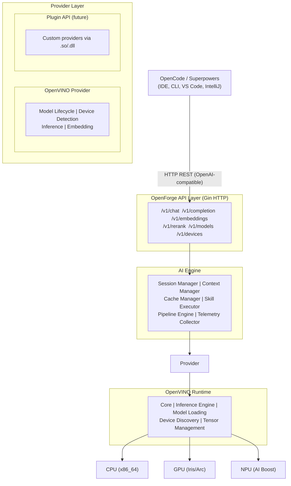
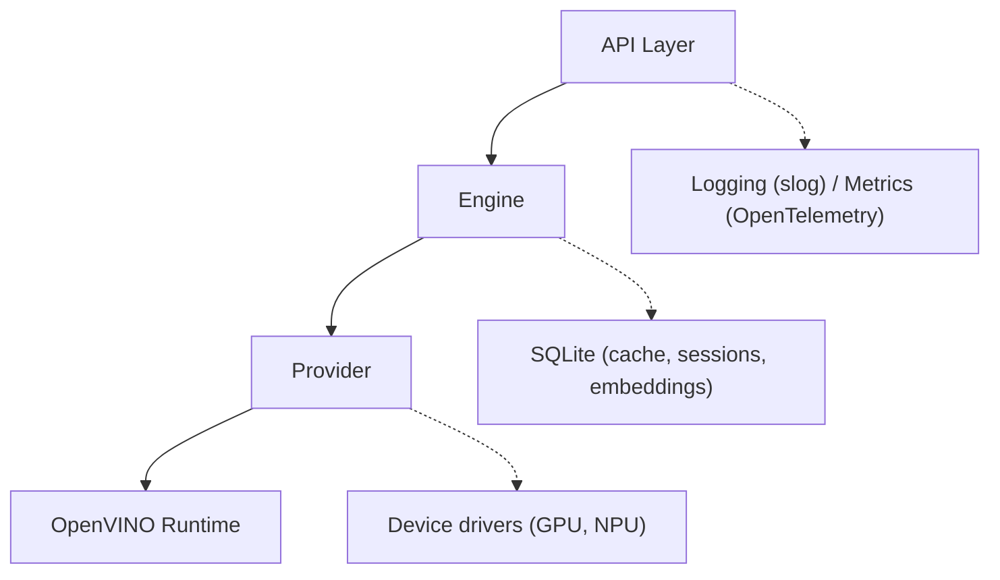
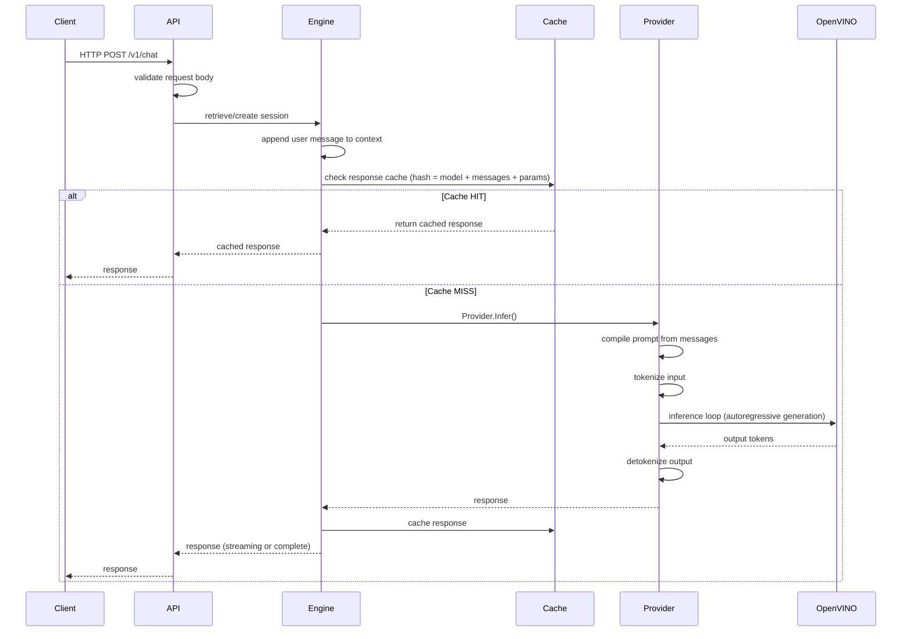
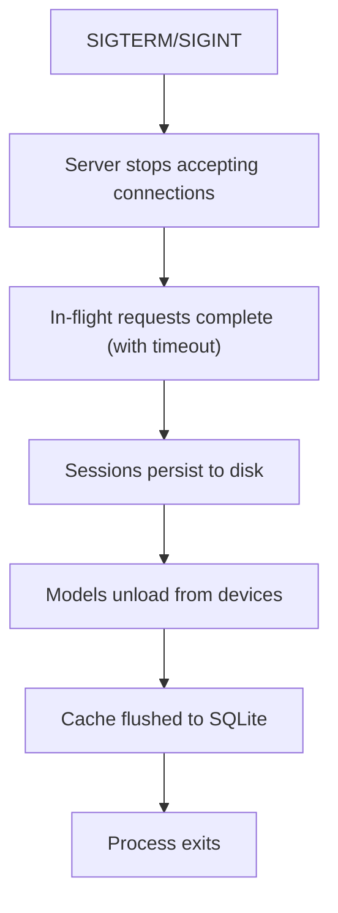

# Architecture

## High-Level Overview

## Layer Responsibilities

### API Layer
- Exposes OpenAI-compatible REST endpoints
- Handles authentication, rate limiting, CORS
- Validates requests, serializes responses
- Serves Swagger UI at `/docs`

### AI Engine
- Orchestrates inference flows (chat, completion, embedding, rerank)
- Manages conversation sessions with context windowing
- Executes Skills as multi-step pipelines
- Caches embeddings and responses (memory + SQLite)
- Collects metrics and traces for observability

### Provider Layer
- Abstracts hardware and runtime details from the Engine
- Implements model lifecycle (load, unload, reload)
- Detects and selects optimal devices automatically
- Plugin API for third-party providers

### OpenVINO Runtime
- Loads OpenVINO IR models (.xml + .bin)
- Compiles models for target devices
- Executes synchronous and asynchronous inference
- Manages device memory and tensor resources

## Dependency Flow

Rules:
- Dependencies point **inward** (API → Engine → Provider → Runtime)
- No layer imports from layers above it
- All inter-layer communication through Go interfaces

## Communication Patterns

| Layer | Protocol | Format |
|-------|----------|--------|
| OpenCode ↔ API | HTTP/1.1 | JSON |
| API ↔ Engine | Go function call | Go structs |
| Engine ↔ Provider | Go interface | Go structs |
| Provider ↔ OpenVINO | CGO / OpenVINO C API | C buffers |

## Cross-Cutting Concerns

- **Logging**: structured logs via slog (standard library)
- **Config**: hierarchical merge per layer
- **Errors**: typed errors with wrapped context
- **Metrics**: counters and histograms (future: OpenTelemetry)
- **Tracing**: distributed spans for critical operations

## Key Design Decisions

| Decision | Rationale |
|----------|-----------|
| Single binary | Easy deployment, no runtime dependencies |
| CGO for OpenVINO | Direct C API access, minimal overhead |
| Interfaces at boundaries | Testable, swappable implementations |
| Async everywhere | Non-blocking inference, streaming support |
| Cache-first design | Embedding cache reduces latency 10x+ |

## Data Flow: Chat Request

## Thread Safety

All components are designed for concurrent access:

| Component | Strategy |
|-----------|----------|
| Sessions | `sync.RWMutex` per session map |
| Models | Reference-counted, write-once |
| Cache | Sharded mutexes per hash bucket |
| Provider | Single-threaded per model + queue |
| Server | Gin handles concurrency per request |

## Graceful Shutdown

