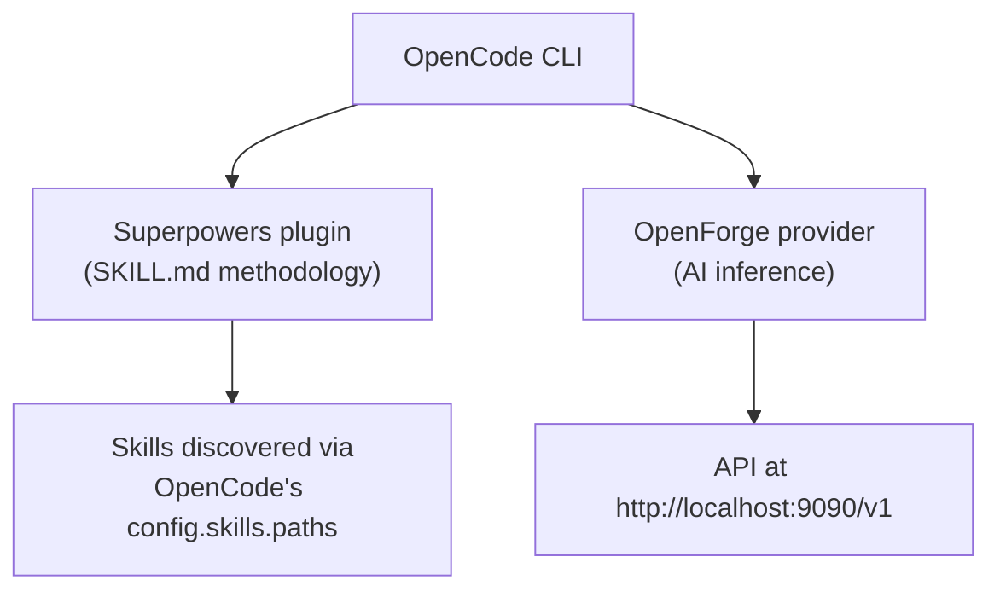

# OpenCode & Superpowers Compatibility

> **⚠️ Aspirational:** The OpenCode/Superpowers provider integration is a conceptual design. The HTTP API is OpenAI-compatible but no native OpenCode provider plugin exists yet.

OpenForge works as a native **provider** for OpenCode and is compatible with the **Superpowers** skill ecosystem.

## Architecture



**Layers don't conflict:**
- **Superpowers** provides agent methodology and instructions (SKILL.md)
- **OpenForge** provides the AI inference engine (YAML pipelines)

## Using OpenForge with OpenCode

Configure OpenCode to use OpenForge as provider:

```json
{
  "provider": "openforge",
  "endpoint": "http://localhost:9090/v1",
  "model": "llama-3.2-3b"
}
```

Requirements:
- OpenForge server must be running (`openforge serve`)
- Model must be loaded
- OpenAI-compatible API means any OpenAI client works

## Using OpenForge with Superpowers

Superpowers installs as an OpenCode plugin independently of OpenForge:

```json
{
  "plugin": ["superpowers@git+https://github.com/obra/superpowers.git"],
  "provider": "openforge",
  "endpoint": "http://localhost:9090/v1"
}
```

Both work together without modification.

## OpenForge Skills vs Superpowers Skills

| Aspect | OpenForge Skills | Superpowers Skills |
|:-------|:-----------------|:-------------------|
| **Format** | YAML pipeline (.yaml) | Markdown + frontmatter (SKILL.md) |
| **Purpose** | Execute AI pipelines | Guide agent behavior |
| **Runtime** | OpenForge engine | AI agent (OpenCode/Claude/etc) |
| **Steps** | prompt, embed, rerank, format | Instructions, methodology |
| **Loading** | `openforge skill run` | OpenCode `skill` tool |
| **Directory** | `skills/` in project | `~/.config/opencode/skills/` |

They are complementary:
- Use **Superpowers skills** for development methodology (brainstorming, debugging, TDD)
- Use **OpenForge skills** for automated AI code generation pipelines

## Example: Combined Workflow

```bash
# 1. Start OpenForge
openforge serve --model phi-3-mini

# 2. OpenCode with Superpowers loads methodology
opencode

# 3. Superpowers skill guides the approach
# "Let's brainstorm this architecture"
# → Superpowers: brainstorming skill

# 4. OpenForge skill generates the code
# openforge skill run go:generate --param description="REST API"
```

## Configuration

OpenForge skills directory: `skills/` in the project root  
Superpowers skills directory: `~/.config/opencode/skills/`  
OpenCode discovers both via native tooling.
