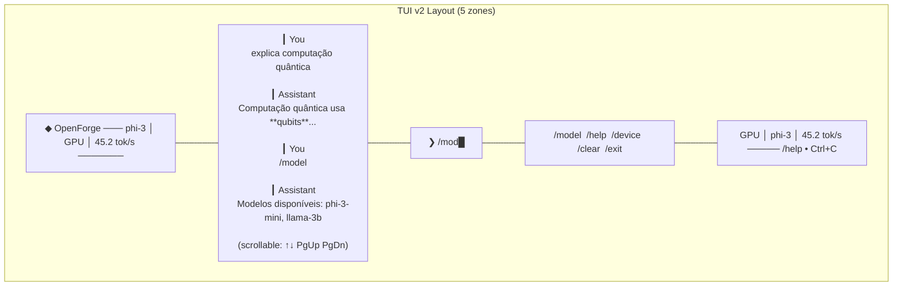
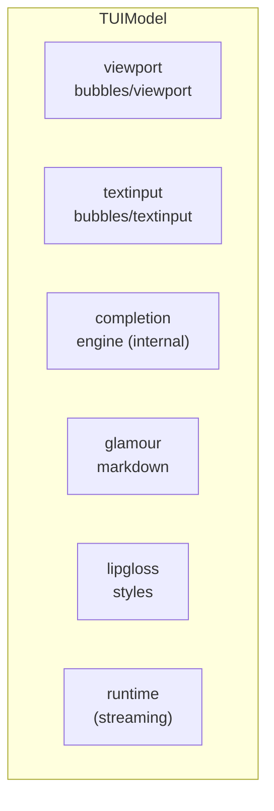
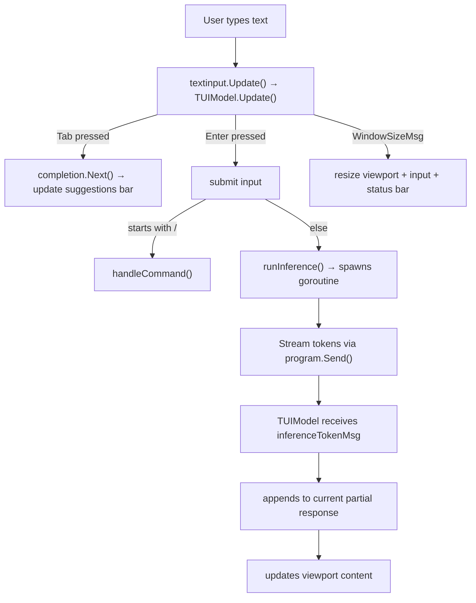

# OpenForge TUI v2 — Readline-Style Chat Interface

**Date:** 2026-06-27
**Status:** Design Approved
**Replaces:** `internal/tui/tui.go` (v1 full-screen TUI)

## Motivation

The v1 TUI was a full-screen bubbletea layout that felt rigid: hardcoded widths, no autocomplete, no scroll in chat history, poor terminal resize handling. User feedback highlighted three pain points: **no autocomplete** (`\` prefix did nothing), **unintuitive** (commands felt undiscoverable), and **unresponsive** (maximize broke layout).

Goal: a Claude Code / opencode-like readline chat interface — minimal, responsive, with autocomplete and markdown rendering.

## Layout



Five zones, top to bottom:
1. **Header** — single line: app name, active model, device, tok/s
2. **Viewport** — scrollable chat history (↑↓ PgUp PgDn, mouse wheel)
3. **Input line** — `❯ ` prompt, handles text input, Tab, Enter, Ctrl shortcuts
4. **Suggestions bar** — contextual autocomplete list below input (toggle on Tab)
5. **Status bar** — device, model, tok/s; fixed at bottom

## Architecture



### Components

| Component | Type | Responsibility |
|-----------|------|---------------|
| `TUIModel` | bubbletea Model | Update loop, message routing, state management |
| `viewport` | `bubbles/viewport.Model` | Scrollable chat history, handles resize |
| `textinput` | `bubbles/textinput.Model` | Input with cursor, character limit, focus |
| `completion` | custom struct | Tab completion: command list, model names, device names |
| `glamour` | `charmbracelet/glamour` | Render markdown to styled terminal output |
| `lipgloss` | `charmbracelet/lipgloss` | Colors, borders, layout primitives |

### Data Flow



## Features

### Tab Autocomplete

| Context | Suggested | Behavior |
|---------|-----------|----------|
| Empty input, Tab | Command list | Show all commands in suggestions bar |
| `/m` Tab | `/model` | Complete to `/model ` (with trailing space) |
| `/model ` Tab | Model names | Show loaded model names |
| `/d` Tab | `/device` | Complete to `/device ` |
| `/device ` Tab | Device names | Show available device IDs |
| During input | Toggle suggestions | Show/hide suggestions bar |

Implementation: maintain `completions []string` on TUIModel. Tab key cycles through matches or toggles the suggestion list. When the user types, recompute matches from:
- `knownCommands` — static list of all `/commands`
- `m.models` — loaded model names (for `/model <...>`)
- `m.devices` — available device IDs (for `/device <...>`)

### Markdown Rendering

Every assistant message (including partial streaming) is rendered through `glamour` before being placed in the viewport. This means:
- `**bold**` → bold text
- `` `code` `` → syntax-highlighted inline code
- ` ``` ` blocks → syntax-highlighted code blocks
- `# headers` → styled headers
- `- lists` → bullet lists

During streaming, re-render the entire accumulated partial response on each token. glamour handles partial/incomplete markdown gracefully (renders what it can, rest as text).

### Resize Handling

No hardcoded widths anywhere:
- `MainStyle` removes `Width(80)`
- `StatusBarStyle` removes `Width(80)`, uses `m.width` directly
- `RenderTitle`/`RenderStatusBar` dynamically calculate spacing from `m.width`
- `viewport.Width`/`Height` set from `m.width`/`m.height` on each WindowSizeMsg
- `textinput.Width` = `m.width - 4` (prompt + padding)

### Streaming

Same mechanism as v1: `runInference` spawns a goroutine that reads from `rt.InferStream()`, sends `inferenceTokenMsg` to the program. The difference:
- Viewport automatically scrolls to bottom on each token (viewport.GotoBottom())
- Message is rendered through glamour on each update (re-render accumulated text)
- No persistent streaming indicator. Show a brief `⠋ thinking...` indicator only during the latency period (before first token arrives). Once streaming starts (first `inferenceTokenMsg` received), clear the indicator and show the partial response as it grows.

### Commands

Same command set, slightly cleaner help:

```
  /help       Show this help
  /model      List models
  /model <n>  Load/switch to model <n>
  /device     List devices
  /device <d> Switch to device <d>
  /clear      Clear chat history
  /exit       Quit
```

Tab completes both command names and their arguments (model names after `/model `, device IDs after `/device `).

## Colors

Keep existing palette (slate dark bg, purple primary, cyan secondary), but reduce visual noise:
- No persistent spinner (brief `⠋ thinking...` text only during pre-stream latency)
- Blank line between messages (cleaner than separator lines)
- Status bar: dimmer, thinner (single line, no background color, just dim foreground)
- Suggestions bar: dim foreground on dark background, only visible when Tab is pressed

## File Changes

| File | Action |
|------|--------|
| `internal/tui/tui.go` | Rewrite entirely: viewport + textinput + completion + glamour |
| `internal/tui/styles.go` | Simplify: remove hardcoded widths, add suggestion styles |
| `cmd/openforge/cmd/tui.go` | Possibly no change (same TUIModel interface) |
| `go.mod` | Add `github.com/charmbracelet/glamour` |

## Out of Scope

- Multi-line input (for now; v1 didn't have it either)
- Session persistence / history saving
- Image/video output
- Mouse support (viewport handles click-to-scroll already)
- Custom keybinding configuration
- Theming

## Testing

| Aspect | Test |
|--------|------|
| Autocomplete | Unit test completion engine against commands, models, devices |
| Viewport | Manual (viewport is visual; test message append/scroll logic) |
| Markdown | Unit test glamour rendering of sample messages |
| Resize | Send WindowSizeMsg with various dimensions, verify layout |
| Streaming | Mock rt.InferStream, verify token-by-token delivery |
| Commands | Unit test handleCommand for each command and edge case |
